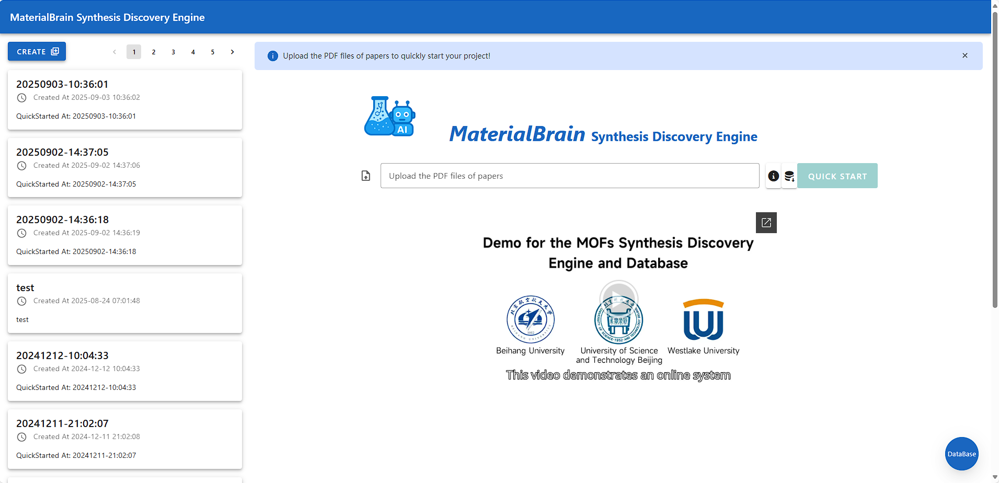
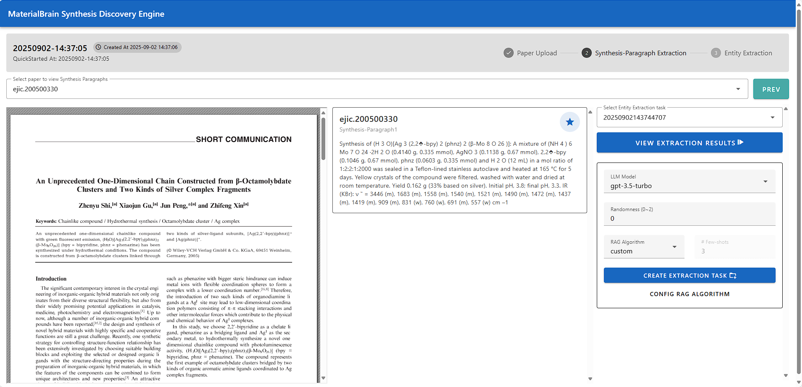
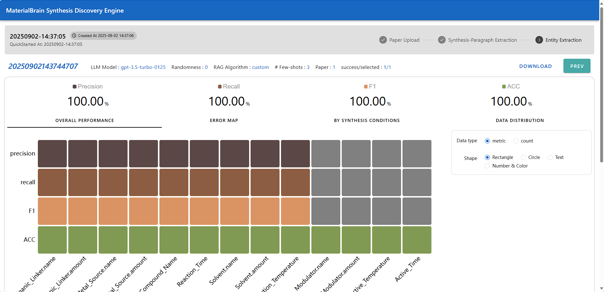
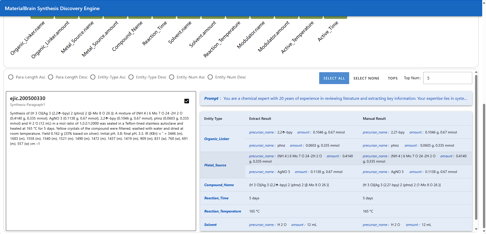

# Overview
Welcome to [**MaterialBrain**](https://materialbrain.com)!

[**MaterialBrain**](https://materialbrain.com) is a tool that leverages Large Language Models (LLMs) to extract synthesis routes from scientific literature. The main workflow is simple:

1. Upload PDF files to create a project.  
2. Review recognized synthesis paragraphs and configure the RAG algorithm.  
3. Extract synthesis conditions and view the results.

Home page: https://materialbrain.com

---

# Step 1: Upload PDF and Create a Project
On the main page, use the form to select one or more PDF files. Then click the **"Quick Start"** button to create a new project.

---

# Step 2: Review Synthesis Paragraphs and Configure RAG
After uploading, the system automatically identifies synthesis paragraphs in each document. The interface shows:

- **Left**: Original PDF file  
- **Center**: Recognized synthesis paragraphs  
- **Right**: RAG algorithm configuration, including:
  - LLM model selection  
  - Randomness (controls the variability of extraction; lower values produce more stable results)  
  - RAG algorithm
  - Shots (number of examples provided to the LLM)
  - More detailed RAG configuration, if you want to select examples manually

Once configured, click **"CREATE EXTRACTION TASK"** to start extracting synthesis routes. After a few seconds, click **"VIEW EXTRACTION RESULTS"** to jump to the results page.

---

# Step 3: View Results
At the top of the results page, the RAG configuration is displayed for reference. Below that, the extraction performance is shown, including:

- **Overall Performance**: Performance over all paragraphs, with detailed metrics per condition  
- **Error Map**: Analysis of errors for each condition
- **By Synthesis Conditions**: Summarizes performance per condition  
- **Data Distribution**: Shows the distribution of extracted data and annotated data

Scrolling down, you can see extraction results for each paragraph. Use the checkboxes in each paragraph and the sorting options at the top to focus on specific data.

---

# Notes
The system currently only supports partial CSD-MOFs data.